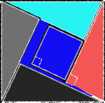

# In-Class Problems Week 1, Wed.

Questions in [**MIT**](https://openlearninglibrary.mit.edu/assets/courseware/v1/c49ce7ef21147a1ef2c3f44473bc5250/asset-v1:OCW+6.042J+2T2019+type@asset+block/MIT6_042JS15_cp1.pdf).

## Problem 1

If *a* and *b* are the lengths of the sides of a right triangle, and *c* is the length of its hypotenuse, then *a²* + *b²* = *c²*;

a)

The square is *(b-a)* x *(b-a)*

b) *a²* + *b²* = *c²*

c) if ***a*=*b***, then the square would not exist and the prove would be the same;

d) 

* the angles are 90º;
* they are connected without spaces;

## Problem 2

a) The mistake is that is supposed that 1 is (-1)(-1), but that is a fallacy, because (-1)(-1) implies 1, but 1 not implies (-1)(-1);

b) Prove that if 1 = -1, then 2 =1 

Assume **1 = -1**.

Then **x = -x ** -> **2x = 0** -> **x=0**

if **x=0**, so **1*x = 0**, then **2x=1*x** -> **2=1**;

c) assume that **r** and **s** are real numbers and that sqrt(rs) > 0

If rs = (r)(s)

then 
$$
\sqrt{rs} = \sqrt{r}\sqrt{s}
$$

## Problem 3

a) When multiplying by the log10(1/2), the sinal should have be reverted, because it is negative;

b) The problem is the units (10c)² = 100c² and not 100c, so different things are being compared;

c)The problem is that (a-b) =0, and you cannot divide by zero;

## Problem 4

if (a+b) >= 2sqrt(ab) and a, b > 0, so (a+b)² MUST be >= (2sqrt(ab))² = 4ab;

The problem indeed is that it is in the reverse order;

## Problem 5

1. The reasoning cannot be applied to Monday, so the test should not have been a surprise;

