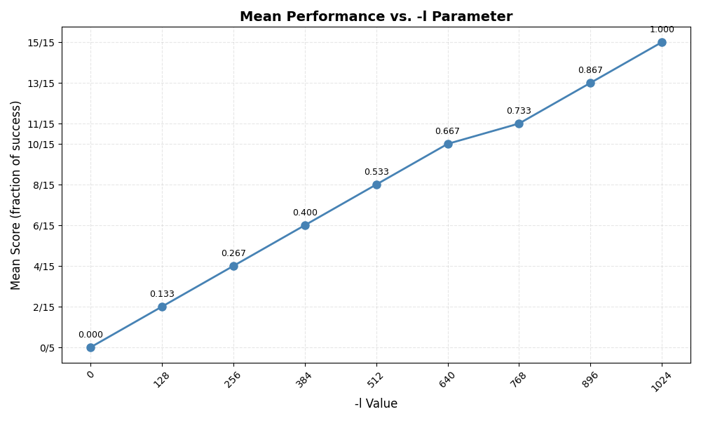

# 15 - Mechanism: Address Translation

The program `relocation.py` allows you to see how address translations are performed in a system with base and bounds registers. See the README for details.

## Questions

1. **Run with seeds 1, 2, and 3, and compute whether each virtual address generated by the process is in or out of bounds. If in bounds, compute the translation.**

  - Seed 1

    ```bash
    Base-and-Bounds register information:
    
      Base   : 0x0000363c (decimal 13884)
      Limit  : 290
    
    Virtual Address Trace
      VA  0: 0x0000030e (decimal:  782) --> PA or segmentation violation?
      VA  1: 0x00000105 (decimal:  261) --> PA or segmentation violation?
      VA  2: 0x000001fb (decimal:  507) --> PA or segmentation violation?
      VA  3: 0x000001cc (decimal:  460) --> PA or segmentation violation?
      VA  4: 0x0000029b (decimal:  667) --> PA or segmentation violation?
    ```

    - VA 0: Segment Violation
    - VA 1: 0x00003741  (14145)
    - VA 2: Segment Violation
    - VA 3: Segment Violation
    - VA 4: Segment Violation
    - VA 5: Segment Violation

  - Seed 2

    ```bash
    Base-and-Bounds register information:
    
      Base   : 0x00003ca9 (decimal 15529)
      Limit  : 500
    
    Virtual Address Trace
      VA  0: 0x00000039 (decimal:   57) --> PA or segmentation violation?
      VA  1: 0x00000056 (decimal:   86) --> PA or segmentation violation?
      VA  2: 0x00000357 (decimal:  855) --> PA or segmentation violation?
      VA  3: 0x000002f1 (decimal:  753) --> PA or segmentation violation?
      VA  4: 0x000002ad (decimal:  685) --> PA or segmentation violation?
    ```

    - VA 0: 0x00003ce2 (15586)
    - VA 1: 0x00003cff (15615)
    - VA 2: Segment Violation
    - VA 3: Segment Violation
    - VA 4: Segment Violation

  - Seed 3

    ```bash
    Base-and-Bounds register information:
    
      Base   : 0x000022d4 (decimal 8916)
      Limit  : 316
    
    Virtual Address Trace
      VA  0: 0x0000017a (decimal:  378) --> PA or segmentation violation?
      VA  1: 0x0000026a (decimal:  618) --> PA or segmentation violation?
      VA  2: 0x00000280 (decimal:  640) --> PA or segmentation violation?
      VA  3: 0x00000043 (decimal:   67) --> PA or segmentation violation?
      VA  4: 0x0000000d (decimal:   13) --> PA or segmentation violation?
    ```

    - VA 0: Segment Violation
    - VA 1: Segment Violation
    - VA 2: Segment Violation
    - VA 3: 0x00002317 (8983)
    - VA 4: 0x000022e1 (8929)

2. **Run with these flags: `-s 0 -n 10`. What value do you have to set `-l` (the bounds register) to in order to ensure that all the generated virtual addresses are within bounds?**

  Running with these flag results in:

  ```bash
  Base-and-Bounds register information:
  
    Base   : 0x00003082 (decimal 12418)
    Limit  : 472
  
  Virtual Address Trace
    VA  0: 0x000001ae (decimal:  430) --> PA or segmentation violation?
    VA  1: 0x00000109 (decimal:  265) --> PA or segmentation violation?
    VA  2: 0x0000020b (decimal:  523) --> PA or segmentation violation?
    VA  3: 0x0000019e (decimal:  414) --> PA or segmentation violation?
    VA  4: 0x00000322 (decimal:  802) --> PA or segmentation violation?
    VA  5: 0x00000136 (decimal:  310) --> PA or segmentation violation?
    VA  6: 0x000001e8 (decimal:  488) --> PA or segmentation violation?
    VA  7: 0x00000255 (decimal:  597) --> PA or segmentation violation?
    VA  8: 0x000003a1 (decimal:  929) --> PA or segmentation violation?
    VA  9: 0x00000204 (decimal:  516) --> PA or segmentation violation?
  ```

  So `-l` must be 930:

  ```bash
  Base-and-Bounds register information:
  
    Base   : 0x0000360b (decimal 13835)
    Limit  : 930
  
  Virtual Address Trace
    VA  0: 0x00000308 (decimal:  776) --> VALID: 0x00003913 (decimal: 14611)
    VA  1: 0x000001ae (decimal:  430) --> VALID: 0x000037b9 (decimal: 14265)
    VA  2: 0x00000109 (decimal:  265) --> VALID: 0x00003714 (decimal: 14100)
    VA  3: 0x0000020b (decimal:  523) --> VALID: 0x00003816 (decimal: 14358)
    VA  4: 0x0000019e (decimal:  414) --> VALID: 0x000037a9 (decimal: 14249)
    VA  5: 0x00000322 (decimal:  802) --> VALID: 0x0000392d (decimal: 14637)
    VA  6: 0x00000136 (decimal:  310) --> VALID: 0x00003741 (decimal: 14145)
    VA  7: 0x000001e8 (decimal:  488) --> VALID: 0x000037f3 (decimal: 14323)
    VA  8: 0x00000255 (decimal:  597) --> VALID: 0x00003860 (decimal: 14432)
    VA  9: 0x000003a1 (decimal:  929) --> VALID: 0x000039ac (decimal: 14764)
  ```

  

3. **Run with these flags: `-s 1 -n 10 -l 100`. What is the maximum value that base can be set to, such that the address space still fits into physical memory in its entirety?**
    Running with these flags results in :

  ```bash
  Base-and-Bounds register information:
  
    Base   : 0x00000899 (decimal 2201)
    Limit  : 100
  
  Virtual Address Trace
    VA  0: 0x00000363 (decimal:  867) --> PA or segmentation violation?
    VA  1: 0x0000030e (decimal:  782) --> PA or segmentation violation?
    VA  2: 0x00000105 (decimal:  261) --> PA or segmentation violation?
    VA  3: 0x000001fb (decimal:  507) --> PA or segmentation violation?
    VA  4: 0x000001cc (decimal:  460) --> PA or segmentation violation?
    VA  5: 0x0000029b (decimal:  667) --> PA or segmentation violation?
    VA  6: 0x00000327 (decimal:  807) --> PA or segmentation violation?
    VA  7: 0x00000060 (decimal:   96) --> PA or segmentation violation?
    VA  8: 0x0000001d (decimal:   29) --> PA or segmentation violation?
    VA  9: 0x00000357 (decimal:  855) --> PA or segmentation violation?
  
  ```

  So the maximum base is $2201+100-(867+1) = 1433.
  ```bash
  Base-and-Bounds register information:
  
    Base   : 0x00000599 (decimal 1433)
    Limit  : 1000
  
  Virtual Address Trace
    VA  0: 0x00000089 (decimal:  137) --> VALID: 0x00000622 (decimal: 1570)
    VA  1: 0x00000363 (decimal:  867) --> VALID: 0x000008fc (decimal: 2300)
    VA  2: 0x0000030e (decimal:  782) --> VALID: 0x000008a7 (decimal: 2215)
    VA  3: 0x00000105 (decimal:  261) --> VALID: 0x0000069e (decimal: 1694)
    VA  4: 0x000001fb (decimal:  507) --> VALID: 0x00000794 (decimal: 1940)
    VA  5: 0x000001cc (decimal:  460) --> VALID: 0x00000765 (decimal: 1893)
    VA  6: 0x0000029b (decimal:  667) --> VALID: 0x00000834 (decimal: 2100)
    VA  7: 0x00000327 (decimal:  807) --> VALID: 0x000008c0 (decimal: 2240)
    VA  8: 0x00000060 (decimal:   96) --> VALID: 0x000005f9 (decimal: 1529)
    VA  9: 0x0000001d (decimal:   29) --> VALID: 0x000005b6 (decimal: 1462)
  ```

  We can see the the biggest value is less than 2301, the max allowed for the original map.

4. **Run some of the same problems above, but with larger address spaces (`-a`) and physical memories (`-p`).**

  Doing so just increase the number of the virtual adress:
  ```bash
  ARG seed 3
  ARG address space size 1g
  ARG phys mem size 2g
  
  Base-and-Bounds register information:
  
    Base   : 0x45a94da2 (decimal 1168723362)
    Limit  : 332313599
  
  Virtual Address Trace
    VA  0: 0x17ad586f (decimal: 397236335) --> SEGMENTATION VIOLATION
    VA  1: 0x26a6a03b (decimal: 648454203) --> SEGMENTATION VIOLATION
    VA  2: 0x280bcd2c (decimal: 671862060) --> SEGMENTATION VIOLATION
    VA  3: 0x04319ff4 (decimal: 70361076) --> VALID: 0x49daed96 (decimal: 1239084438)
    VA  4: 0x00d7be8f (decimal: 14139023) --> VALID: 0x46810c31 (decimal: 1182862385)
  ```

  

5. **What fraction of randomly-generated virtual addresses are valid, as a function of the value of the bounds register? Make a graph from running with different random seeds, with limit values ranging from 0 up to the maximum size of the address space.**
    The base is indifferent for that, as the virtual address starts at 0. So we use `-b 0` and the only variable here is `-l`, the limit register.
    The address space size will be 1024 and physical space 2048.
    We start at 0 and goes up until 1024 in steps of size 128.

  | `-l` | seed 1 | seed 2 | seed 3 | Mean  |
  | ---- | ------ | ------ | ------ | ----- |
  | 0    | 0/5    | 0/5    | 0/5    | 0/15  |
  | 128  | 0/5    | 2/5    | 0/5    | 2/15  |
  | 256  | 1/5    | 2/5    | 1/5    | 4/15  |
  | 384  | 2/5    | 2/5    | 2/5    | 6/15  |
  | 512  | 3/5    | 3/5    | 2/5    | 8/15  |
  | 640  | 3/5    | 3/5    | 4/5    | 10/15 |
  | 768  | 3/5    | 3/5    | 5/5    | 11/15 |
  | 896  | 5/5    | 3/5    | 5/5    | 13/15 |
  | 1024 | 5/5    | 5/5    | 5/5    | 15/15 |

  The mean curve it is almost linear.

  
