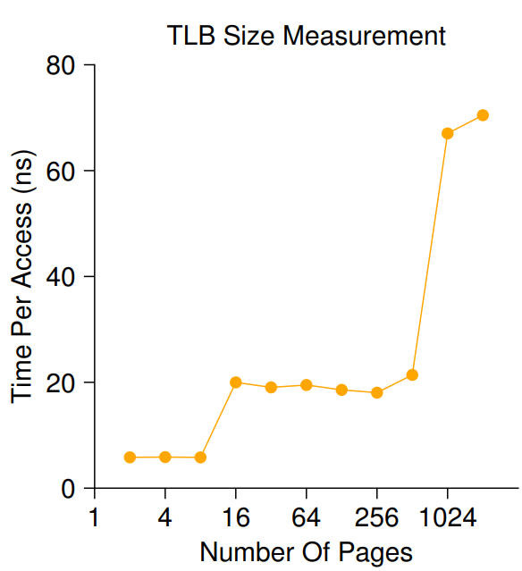
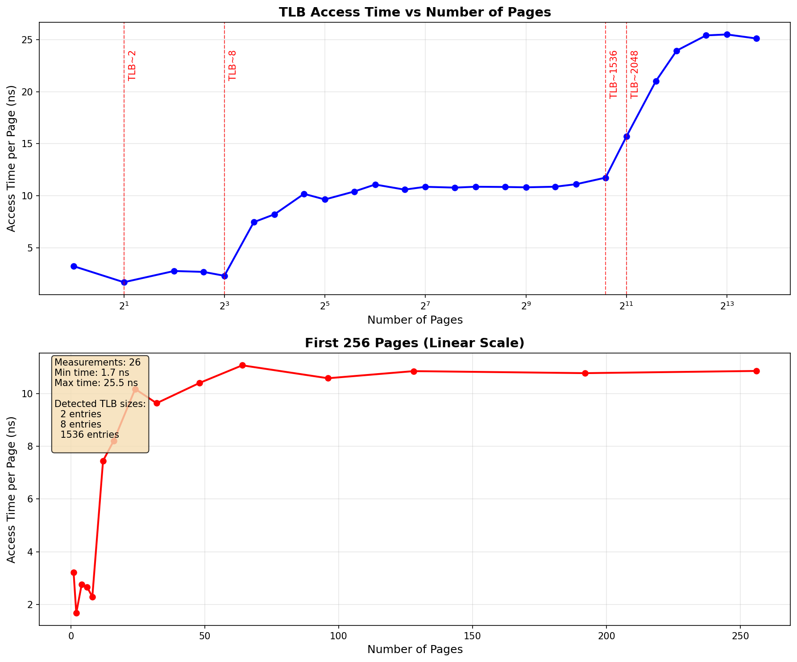
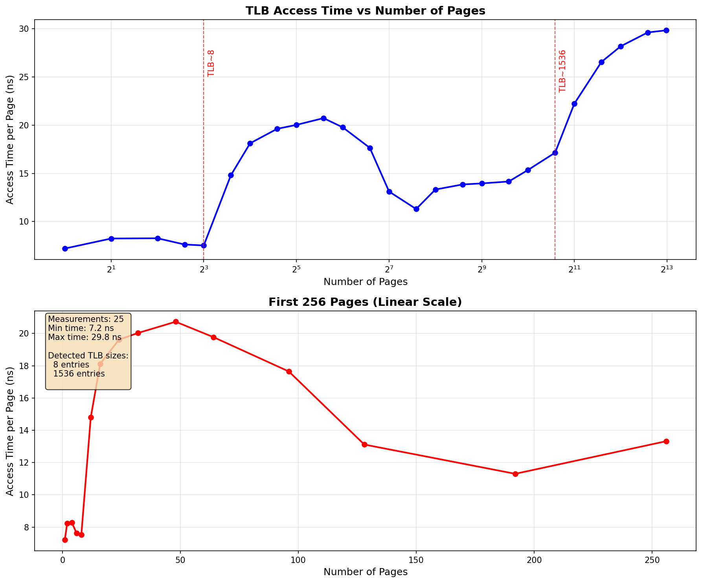

# 19 - Paging: Faster Translations (TLBs)

## Homework (Measurement)

In this homework, you are to measure the size and cost of accessing a TLB. The idea is based on work by Saavedra-Barrera [SB92], who developed a simple but beautiful method to measure numerous aspects of cache hierarchies, all with a very simple user-level program. Read his work for more details.

The basic idea is to access some number of pages within a large data structure (e.g., an array) and to time those accesses. For example, let’s say the TLB size of a machine happens to be 4 (which would be very small, but useful for the purposes of this discussion). If you write a program that touches 4 or fewer pages, each access should be a TLB hit, and thus relatively fast. However, once you touch 5 pages or more, repeatedly in a loop, each access will suddenly jump in cost, to that of a TLB miss.

The basic code to loop through an array once should look like this:

```c
int jump = PAGESIZE / sizeof(int);
for (i = 0; i < NUMPAGES * jump; i += jump)
	a[i] += 1;
```

In this loop, one integer per page of the array a is updated, up to the number of pages specified by `NUMPAGES`. By timing such a loop repeatedly (say, a few hundred million times in another loop around this one, or however many loops are needed to run for a few seconds), you can time how long each access takes (on average). By looking for jumps in cost as `NUMPAGES` increases, you can roughly determine how big the first-level TLB is, determine whether a second-level TLB exists (and how big it is if it does), and in general get a good sense of how TLB hits and misses can affect performance.



​                                                                                     Figure 19.5: Discovering TLB Sizes and Miss Costs

Figure 19.5 (page 15) shows the average time per access as the number of pages accessed in the loop is increased. As you can see in the graph, when just a few pages are accessed (8 or fewer), the average access time is roughly 5 nanoseconds. When 16 or more pages are accessed, there is a sudden jump to about 20 nanoseconds per access. A final jump in cost occurs at around 1024 pages, at which point each access takes around 70 nanoseconds. From this data, we can conclude that there is a two-level TLB hierarchy; the first is quite small (probably holding between 8 and 16 entries); the second is larger but slower (holding roughly 512 entries). The overall difference between hits in the first-level TLB and misses is quite large, roughly a factor of fourteen. TLB performance matters!

## Questions

1. **For timing, you’ll need to use a timer (e.g., `gettimeofday()`). How precise is such a timer? How long does an operation have to take in order for you to time it precisely? (this will help determine how many times, in a loop, you’ll have to repeat a page access in order to time it successfully)**
    `gettimeofday` gives the number of seconds and microseconds since the Epoch, so the precision is of $\pm$​ 1 microsecond. `clock_gettime()` gives seconds and nanoseconds  since the Epoch, so the precision is $\pm$ 1 nanosecond, which is more precise.
    Thus an operation must take at least 10 nanoseconds to be precisely timed, when using `clock_gettime`.
2. **Write the program, called `tlb.c,` that can roughly measure the cost of accessing each page. Inputs to the program should be: the number of pages to touch and the number of trials.**

  Code in [`tlb.c`](./programming-files/tlb.c)
3. **Now write a script in your favorite scripting language (bash?) to run this program, while varying the number of pages accessed from 1 up to a few thousand, perhaps incrementing by a factor of two per iteration. Run the script on different machines and gather some data. How many trials are needed to get reliable measurements?**
    Code in  [`tlb_experiment.py`](./programming-files/tlb_experiment.py).
    I have been setting for 1000000 trials and then half of it.

  #### Results

  ##### Ubuntu

  ```bash
  python3 tlb_experiment.py -m 8192
  === TLB Size Measurement Experiment ===
  Program: ./tlb
  Max pages: 8192
  Base trials: 1000000
  Step type: mixed
  Runs per measurement: 3
  ==================================================
  Testing 26 page counts: [1, 2, 4, 6, 8, 12, 16, 24, 32, 48]...
  
  [  1/ 26] Pages:    1, Trials:  1000000...    3.22 ns (±0.01)
  [  2/ 26] Pages:    2, Trials:  1000000...    1.68 ns (±0.02)
  [  3/ 26] Pages:    4, Trials:  1000000...    2.76 ns (±2.01)
  [  4/ 26] Pages:    6, Trials:  1000000...    2.67 ns (±1.26)
  [  5/ 26] Pages:    8, Trials:  1000000...    2.30 ns (±0.01)
  [  6/ 26] Pages:   12, Trials:  1000000...    7.45 ns (±0.50)
  [  7/ 26] Pages:   16, Trials:  1000000...    8.21 ns (±0.77)
  [  8/ 26] Pages:   24, Trials:  1000000...   10.17 ns (±0.43)
  [  9/ 26] Pages:   32, Trials:  1000000...    9.63 ns (±0.02)
  [ 10/ 26] Pages:   48, Trials:  1000000...   10.40 ns (±0.07)
  [ 11/ 26] Pages:   64, Trials:  1000000...   11.07 ns (±0.54)
  [ 12/ 26] Pages:   96, Trials:   500000...   10.58 ns (±0.14)
  [ 13/ 26] Pages:  128, Trials:   500000...   10.85 ns (±0.21)
  [ 14/ 26] Pages:  192, Trials:   500000...   10.77 ns (±0.25)
  [ 15/ 26] Pages:  256, Trials:   500000...   10.86 ns (±0.17)
  [ 16/ 26] Pages:  384, Trials:   250000...   10.83 ns (±0.02)
  [ 17/ 26] Pages:  512, Trials:   250000...   10.80 ns (±0.09)
  [ 18/ 26] Pages:  768, Trials:   250000...   10.86 ns (±0.09)
  [ 19/ 26] Pages: 1024, Trials:   250000...   11.10 ns (±0.06)
  [ 20/ 26] Pages: 1536, Trials:   125000...   11.73 ns (±0.04)
  [ 21/ 26] Pages: 2048, Trials:   125000...   15.68 ns (±0.29)
  [ 22/ 26] Pages: 3072, Trials:   125000...   21.00 ns (±0.42)
  [ 23/ 26] Pages: 4096, Trials:   125000...   23.94 ns (±1.34)
  [ 24/ 26] Pages: 6144, Trials:   125000...   25.41 ns (±0.29)
  [ 25/ 26] Pages: 8192, Trials:   125000...   25.50 ns (±0.32)
  [ 26/ 26] Pages: 12288, Trials:   125000...   25.11 ns (±0.27)
  
  Experiment complete! Successfully measured 26/26 points
  
  ============================================================
  TLB ANALYSIS RESULTS
  ============================================================
  
  Measurements: 26 data points
  Page range: 1 to 12288 pages
  
  Access Time Statistics:
    Minimum: 1.68 ns
    Maximum: 25.50 ns
    Average: 11.71 ns
    Median:  10.82 ns
    Range:   23.82 ns
  
  ============================================================
  DETECTED TLB CHARACTERISTICS
  ============================================================
  
  Jump 1:
    Detected at: 2 → 4 pages
    Increase: 64.4%
    Estimated TLB size: 2 entries
    Hit time: 1.68 ns
    Miss penalty: 1.08 ns
  
  Jump 2:
    Detected at: 8 → 12 pages
    Increase: 224.4%
    Estimated TLB size: 8 entries
    Hit time: 2.30 ns
    Miss penalty: 5.15 ns
  
  Jump 3:
    Detected at: 1536 → 2048 pages
    Increase: 33.7%
    Estimated TLB size: 1536 entries
    Hit time: 11.73 ns
    Miss penalty: 3.95 ns
  
  Jump 4:
    Detected at: 2048 → 3072 pages
    Increase: 33.9%
    Estimated TLB size: 2048 entries
    Hit time: 15.68 ns
    Miss penalty: 5.32 ns
  
  ============================================================
  INFERRED TLB HIERARCHY
  ============================================================
  
  L1 TLB:
    Size: 2 entries
    Hit time: 1.68 ns
    Miss penalty: 1.08 ns
  
  L2 TLB:
    Size: 8 entries
    Hit time: 2.30 ns
    Miss penalty: 5.15 ns
  
  Level 3 TLB:
    Size: 1536 entries
    Hit time: 11.73 ns
    Miss penalty: 3.95 ns
  
  Level 4 TLB:
    Size: 2048 entries
    Hit time: 15.68 ns
    Miss penalty: 5.32 ns
  
  ```

  
Results after changes from question 5 and 6.

```bash
python3 tlb_experiment.py -m 8096
=== TLB Size Measurement Experiment ===
Program: ./tlb
Max pages: 8096
Base trials: 1000000
Step type: mixed
Runs per measurement: 3
==================================================
Testing 25 page counts: [1, 2, 4, 6, 8, 12, 16, 24, 32, 48]...

[  1/ 25] Pages:    1, Trials:  1000000...    7.20 ns (±0.33)
[  2/ 25] Pages:    2, Trials:  1000000...    8.24 ns (±0.57)
[  3/ 25] Pages:    4, Trials:  1000000...    8.27 ns (±0.82)
[  4/ 25] Pages:    6, Trials:  1000000...    7.62 ns (±0.09)
[  5/ 25] Pages:    8, Trials:  1000000...    7.52 ns (±0.03)
[  6/ 25] Pages:   12, Trials:  1000000...   14.80 ns (±0.62)
[  7/ 25] Pages:   16, Trials:  1000000...   18.12 ns (±0.47)
[  8/ 25] Pages:   24, Trials:  1000000...   19.62 ns (±0.26)
[  9/ 25] Pages:   32, Trials:  1000000...   20.03 ns (±1.20)
[ 10/ 25] Pages:   48, Trials:  1000000...   20.73 ns (±0.16)
[ 11/ 25] Pages:   64, Trials:  1000000...   19.78 ns (±1.90)
[ 12/ 25] Pages:   96, Trials:   500000...   17.65 ns (±0.67)
[ 13/ 25] Pages:  128, Trials:   500000...   13.12 ns (±3.16)
[ 14/ 25] Pages:  192, Trials:   500000...   11.30 ns (±0.06)
[ 15/ 25] Pages:  256, Trials:   500000...   13.32 ns (±1.33)
[ 16/ 25] Pages:  384, Trials:   250000...   13.85 ns (±0.85)
[ 17/ 25] Pages:  512, Trials:   250000...   13.96 ns (±0.46)
[ 18/ 25] Pages:  768, Trials:   250000...   14.16 ns (±0.39)
[ 19/ 25] Pages: 1024, Trials:   250000...   15.35 ns (±0.35)
[ 20/ 25] Pages: 1536, Trials:   125000...   17.15 ns (±0.37)
[ 21/ 25] Pages: 2048, Trials:   125000...   22.23 ns (±0.23)
[ 22/ 25] Pages: 3072, Trials:   125000...   26.56 ns (±0.62)
[ 23/ 25] Pages: 4096, Trials:   125000...   28.18 ns (±0.49)
[ 24/ 25] Pages: 6144, Trials:   125000...   29.62 ns (±0.41)
[ 25/ 25] Pages: 8096, Trials:   125000...   29.84 ns (±0.04)

Experiment complete! Successfully measured 25/25 points

============================================================
TLB ANALYSIS RESULTS
============================================================

Measurements: 25 data points
Page range: 1 to 8096 pages

Access Time Statistics:
  Minimum: 7.20 ns
  Maximum: 29.84 ns
  Average: 16.73 ns
  Median:  15.35 ns
  Range:   22.63 ns

============================================================
DETECTED TLB CHARACTERISTICS
============================================================

Jump 1:
  Detected at: 8 → 12 pages
  Increase: 96.8%
  Estimated TLB size: 8 entries
  Hit time: 7.52 ns
  Miss penalty: 7.28 ns

Jump 2:
  Detected at: 1536 → 2048 pages
  Increase: 29.6%
  Estimated TLB size: 1536 entries
  Hit time: 17.15 ns
  Miss penalty: 5.08 ns

============================================================
INFERRED TLB HIERARCHY
============================================================

L1 TLB:
  Size: 8 entries
  Hit time: 7.52 ns
  Miss penalty: 7.28 ns

L2 TLB:
  Size: 1536 entries
  Hit time: 17.15 ns
  Miss penalty: 5.08 ns
```



We can observe that without the optimizations, the results became more random.

4. **Next, graph the results, making a graph that looks similar to the one above. Use a good tool like ploticus or even zplot. Visualization usually makes the data much easier to digest; why do you think that is?**
     Code of previous question already contains the plotting.
     The graph clearly shows the jumps, changes, and trends. Just using the raw numbers is harder to understand that.

5. **One thing to watch out for is compiler optimization. Compilers do all sorts of clever things, including removing loops which increment values that no other part of the program subsequently uses. How can you ensure the compiler does not remove the main loop above from your TLB size estimator?**

     Key techniques to prevent compiler optimization:
     1. **Accumulate a result and use it:**
          Accumulate a value inside the loop (e.g., sum up array accesses) and print or otherwise use the result after the loop. This makes the loop’s effect observable.
     2. **Use the volatile keyword:**
          Declare the pointer or variable being accessed as volatile, which tells the compiler not to optimize away accesses to it.
     3. **Compiler barriers:**
          Use platform/compiler-specific barriers (like `asm volatile("" ::: "memory");` in GCC/Clang) to prevent certain optimizations, though this is less portable.

4. **Another thing to watch out for is the fact that most systems today ship with multiple CPUs, and each CPU, of course, has its own TLB hierarchy. To really get good measurements, you have to run your code on just one CPU, instead of letting the scheduler bounce it from one CPU to the next. How can you do that? (hint: look up “pinning a thread” on Google for some clues) What will happen if you don’t do this, and the code moves from one CPU to the other?**

     To ensure your code runs on just one CPU, you shall “pin” the process or thread to a specific CPU core. This is called setting the CPU affinity. On Linux, you can use the `sched_setaffinity()` system call to do this in C.

     If you don’t pin your process to a single CPU, the OS scheduler may move it between CPUs. Each CPU has its own TLB, so when your process moves to a different CPU, the TLB will be cold (empty) for your process, causing more TLB misses and making your measurements inaccurate and noisy.
5. **Another issue that might arise relates to initialization. If you don’t initialize the array a above before accessing it, the first time you access it will be very expensive, due to initial access costs such as demand zeroing. Will this affect your code and its timing? What can you do to counterbalance these potential costs?**

     If you don’t initialize the array before timing, the first access to each page will be slow due to demand paging and zeroing by the OS. This will artificially inflate your timing results.

     To counterbalance this, you should “touch” (initialize) every page of the array before starting your timing loop. This ensures all pages are mapped into memory and any initial costs are paid before measurement begins.
