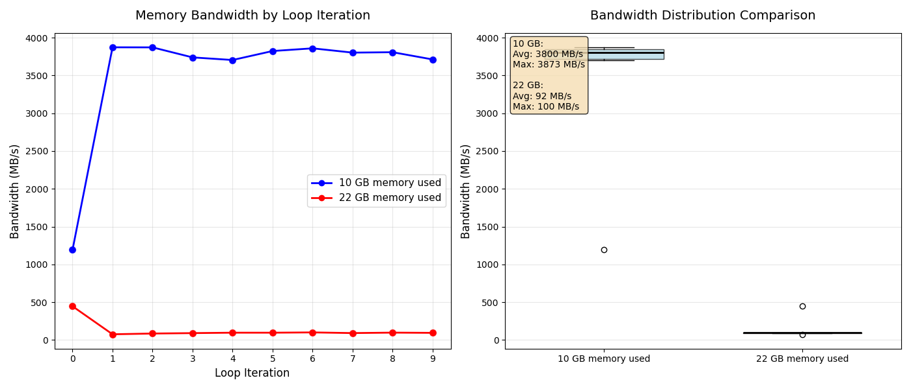

# 21 - Beyond Physical Memory: Mechanisms

## Homework (Measurement)

This homework introduces you to a new tool, `vmstat`, and how it can be used to understand memory, CPU, and I/O usage. Read the associated `README` and examine the code in `mem.c` before proceeding to the exercises and questions below.

### Questions

1. **First, open two separate terminal connections to the same machine, so that you can easily run something in one window and the other. Now, in one window, run `vmstat 1`, which shows statistics about machine usage every second. Read the man page, the associated `README`, and any other information you need so that you can understand its output. Leave this window running vmstat for the rest of the exercises below.**
**Now, we will run the program `mem.c` but with very little memory usage. This can be accomplished by typing `./mem 1` (which uses only 1 MB of memory).**
**How do the CPU usage statistics change when running `mem`?**

It increased the value from the us column from around 1 to around 20.
**Do the numbers in the user time column make sense?**

Yes, it shows that the `mem` process is running.
**How does this change when running more than one instance of `mem` at once?**

Almost doubled the us time,
2. **Let’s now start looking at some of the memory statistics while running `mem`. We’ll focus on two columns: `swpd` (the amount of virtual memory used) and `free` (the amount of idle memory). Run `./mem 1024` (which allocates 1024 MB) and watch how these values change. Then kill the running program (by typing control-c) and watch again how the values change.**
    **What do you notice about the values?**

  `swpd` start at 0 and `free` around 11636928.

  The `swpd` kept at 0, while `free`  decreased around 1 GB, to around 10696872
  **In particular, how does the free column change when the program exits?**

  It gets back the 1 GB, going back to around 11683968.
  **Does the amount of free memory increase by the expected amount when `mem` exits?**
  It does!
3. **We’ll next look at the swap columns (`si` and `so`), which indicate how much swapping is taking place to and from the disk. Of course, to activate these, you’ll need to run `mem` with large amounts of memory. First, examine how much free memory is on your Linux system (for example, by typing cat /proc/meminfo; type man proc for details on the /proc file system and the types of information you can find there). One of the first entries in /proc/meminfo is the total amount of memory in your system. Let’s assume it’s something like 8 GB of memory; if so, start by running mem 4000 (about 4 GB) and watching the swap in/out columns. Do they ever give non-zero values? Then, try with 5000, 6000, etc. What happens to these values as the program enters the second loop (and beyond), as compared to the first loop? How much data (total) are swapped in and out during the second, third, and subsequent loops? (do the numbers make sense?)**

  My machine as 20 GB of memory, so I started with 10 GB.
  `si` and `so` still 0.

  Then I tried with 12 GB, I got `so` 32228, 1680, 224, then bunches of 0, but `si` is always 0, probably the `so` is from other stuff.

  Then I tried with 14 GB, I got a bunch of `so` and then some `si`, the `so` is in general way big than the `si` like $10^4$ of difference, then after some loops I kept just getting smalls `si`. After killing it, a bunch of `si` appeared.

  Then I finally tried with 16 GB, same pattern as before, with massive amounts of `so` and some `si`, but now the `si` are bigger than before. During the start of the loop, the swap movement is larger.


4. **Do the same experiments as above, but now watch the other statistics (such as CPU utilization, and block I/O statistics). How do they change when `mem` is running?**

   #### Before

   The `us` and `sy` are around 0.

   The `bi` is almost always 0, as `bo` is alternating between 0 and a 2 digits value.

   #### 10 GB

   The `us` increased to around 20, `sy` still the same.

   `bi` still 0, `bo` now sometimes also alternate for 3 digits number.

   #### 12 GB

   `bi` for a moment had a 4 digits value then 4 positive values and then just 0.
   `bo` now alternates with 4 digits number.
   The `us`and `sy`is the same as the previous one.

   #### 14 GB

   The same as before.

   #### 16 GB

   Now the `bo` got huge 5 digits value and frequently positive values.

   The `bi` now alternates with 5 digits number.

   The `us`and `sy`is the same as the previous one.
   
5. **Now let’s examine performance. Pick an input for mem that comfortably fits in memory (say 4000 if the amount of memory on the system is 8 GB).**

   I am using 10 GB.
   **How long does loop 0 take (and subsequent loops 1, 2, etc.)?**

   ```bash
   loop 0 in 8587.42 ms (bandwidth: 1192.44 MB/s)
   loop 1 in 2643.97 ms (bandwidth: 3872.96 MB/s)
   loop 2 in 2644.56 ms (bandwidth: 3872.11 MB/s)
   loop 3 in 2738.36 ms (bandwidth: 3739.46 MB/s)
   loop 4 in 2763.96 ms (bandwidth: 3704.83 MB/s)
   loop 5 in 2678.03 ms (bandwidth: 3823.71 MB/s)
   loop 6 in 2653.22 ms (bandwidth: 3859.46 MB/s)
   loop 7 in 2692.88 ms (bandwidth: 3802.62 MB/s)
   loop 8 in 2689.03 ms (bandwidth: 3808.06 MB/s)
   loop 9 in 2758.36 ms (bandwidth: 3712.35 MB/s)
   loop 10 in 2674.19 ms (bandwidth: 3829.19 MB/s)
   loop 11 in 2644.06 ms (bandwidth: 3872.83 MB/s)
   loop 12 in 2676.07 ms (bandwidth: 3826.51 MB/s)
   loop 13 in 2649.06 ms (bandwidth: 3865.52 MB/s)
   loop 14 in 2641.84 ms (bandwidth: 3876.08 MB/s)
   loop 15 in 2647.70 ms (bandwidth: 3867.51 MB/s)
   loop 16 in 2718.82 ms (bandwidth: 3766.34 MB/s)
   loop 17 in 2708.73 ms (bandwidth: 3780.37 MB/s)
   ```

   **Now pick a size comfortably beyond the size of memory (say 12000 again assuming 8 GB of memory).**

   I am using 22 GB.

   **How long do the loops take here?**

   ```bash
   loop 0 in 50527.33 ms (bandwidth: 445.86 MB/s)
   loop 1 in 299601.92 ms (bandwidth: 75.19 MB/s)
   loop 2 in 264773.01 ms (bandwidth: 85.08 MB/s)
   loop 3 in 248730.12 ms (bandwidth: 90.57 MB/s)
   loop 4 in 234224.28 ms (bandwidth: 96.18 MB/s)
   loop 5 in 234511.85 ms (bandwidth: 96.06 MB/s)
   loop 6 in 225488.32 ms (bandwidth: 99.91 MB/s)
   loop 7 in 247303.78 ms (bandwidth: 91.09 MB/s)
   loop 8 in 232133.65 ms (bandwidth: 97.05 MB/s)
   loop 9 in 239695.11 ms (bandwidth: 93.99 MB/s)
   ```

   **How do the bandwidth numbers compare?**
   Using more than available in memory causes far lower bandwith numbers,

   **How different is performance when constantly swapping versus fitting everything comfortably in memory? **

   Fitting in memory is 100 times better.
   **Can you make a graph, with the size of memory used by mem on the x-axis, and the bandwidth of accessing said memory on the y-axis?**
   

   **Finally, how does the performance of the first loop compare to that of subsequent loops, for both the case where everything fits in memory and where it doesn’t?**
   In the first case, the performance is worse at the first loop and later improves and stabilizes, while for the second case is the inverse, it begins better than worsens and stabilizes.
   Also the first loop value is the most near between the cases, showing a probably similar process at the start.

6. **Swap space isn’t infinite. You can use the tool swapon with the -s flag to see how much swap space is available. What happens if you try to run mem with increasingly large values, beyond what seems to be available in swap? At what point does the memory allocation fail?**
   The computer starts freezing, than completely freezes when needing more than available in swap.
