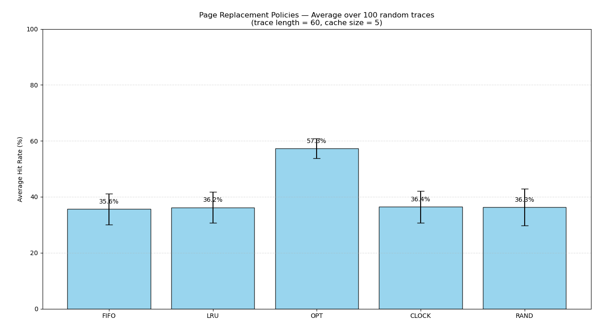
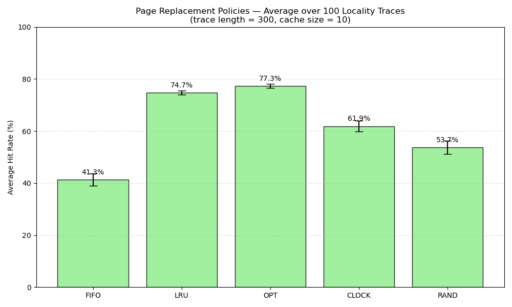
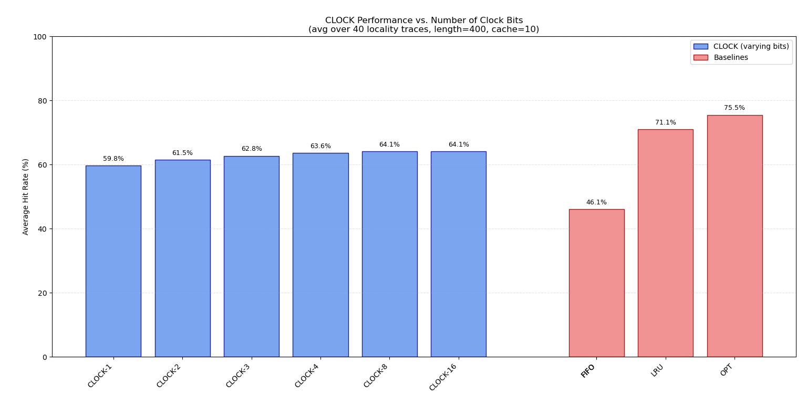

# 22 - Beyond Physical Memory: Policies


## Homework (Simulation)

This simulator, `paging-policy.py`, allows you to play around with different page-replacement policies. See the [`README`](./simulation-files/HW-Paging-Policy/README.md) for details.

### Questions

1. **Generate random addresses with the following arguments: `-s 0 -n 10`, `-s 1 -n 10`, and `-s 2 -n 10`. Change the policy from `FIFO`, to `LRU`, to `OPT`. Compute whether each access in said address traces are hits or misses.**

  #### `FIFO`

  ```bash
  ARG addresses -1
  ARG addressfile 
  ARG numaddrs 10
  ARG policy FIFO
  ARG clockbits 2
  ARG cachesize 3
  ARG maxpage 10
  ARG seed 0
  ARG notrace False
  
  Assuming a replacement policy of FIFO, and a cache of size 3 pages,
  figure out whether each of the following page references hit or miss
  in the page cache.
  
  Access: 8  Hit/Miss?  State of Memory? -> Miss
  Access: 7  Hit/Miss?  State of Memory? -> Miss
  Access: 4  Hit/Miss?  State of Memory? -> Miss
  Access: 2  Hit/Miss?  State of Memory? -> Miss
  Access: 5  Hit/Miss?  State of Memory? -> Miss
  Access: 4  Hit/Miss?  State of Memory? -> Hit
  Access: 7  Hit/Miss?  State of Memory? -> Miss
  Access: 3  Hit/Miss?  State of Memory? -> Miss
  Access: 4  Hit/Miss?  State of Memory? -> Miss
  
  ----------------------------------------------------------------------------
  
  ARG addresses -1
  ARG addressfile 
  ARG numaddrs 10
  ARG policy FIFO
  ARG clockbits 2
  ARG cachesize 3
  ARG maxpage 10
  ARG seed 1
  ARG notrace False
  
  Assuming a replacement policy of FIFO, and a cache of size 3 pages,
  figure out whether each of the following page references hit or miss
  in the page cache.
  
  Access: 1  Hit/Miss?  State of Memory? -> Miss
  Access: 8  Hit/Miss?  State of Memory? -> Miss
  Access: 7  Hit/Miss?  State of Memory? -> Miss
  Access: 2  Hit/Miss?  State of Memory? -> Miss
  Access: 4  Hit/Miss?  State of Memory? -> Miss
  Access: 4  Hit/Miss?  State of Memory? -> Hit
  Access: 6  Hit/Miss?  State of Memory? -> Miss
  Access: 7  Hit/Miss?  State of Memory? -> Miss
  Access: 0  Hit/Miss?  State of Memory? -> Miss
  Access: 0  Hit/Miss?  State of Memory? -> Hit
  
  ----------------------------------------------------------------------------
  
  ARG addresses -1
  ARG addressfile 
  ARG numaddrs 10
  ARG policy FIFO
  ARG clockbits 2
  ARG cachesize 3
  ARG maxpage 10
  ARG seed 2
  ARG notrace False
  
  Assuming a replacement policy of FIFO, and a cache of size 3 pages,
  figure out whether each of the following page references hit or miss
  in the page cache.
  
  Access: 9  Hit/Miss?  State of Memory? -> Miss
  Access: 9  Hit/Miss?  State of Memory? -> Hit
  Access: 0  Hit/Miss?  State of Memory? -> Miss
  Access: 0  Hit/Miss?  State of Memory? -> Hit
  Access: 8  Hit/Miss?  State of Memory? -> Miss
  Access: 7  Hit/Miss?  State of Memory? -> Miss
  Access: 6  Hit/Miss?  State of Memory? -> Miss
  Access: 3  Hit/Miss?  State of Memory? -> Miss
  Access: 6  Hit/Miss?  State of Memory? -> Hit
  Access: 6  Hit/Miss?  State of Memory? -> Hit
  ```

  

  #### `LRU`

  ```bash
  ARG addresses -1
  ARG addressfile 
  ARG numaddrs 10
  ARG policy LRU
  ARG clockbits 2
  ARG cachesize 3
  ARG maxpage 10
  ARG seed 0
  ARG notrace False
  
  Assuming a replacement policy of LRU, and a cache of size 3 pages,
  figure out whether each of the following page references hit or miss
  in the page cache.
  
  Access: 8  Hit/Miss?  State of Memory? -> Miss
  Access: 7  Hit/Miss?  State of Memory? -> Miss
  Access: 4  Hit/Miss?  State of Memory? -> Miss
  Access: 2  Hit/Miss?  State of Memory? -> Miss
  Access: 5  Hit/Miss?  State of Memory? -> Miss
  Access: 4  Hit/Miss?  State of Memory? -> Hit
  Access: 7  Hit/Miss?  State of Memory? -> Miss
  Access: 3  Hit/Miss?  State of Memory? -> Miss
  Access: 4  Hit/Miss?  State of Memory? -> Hit
  Access: 5  Hit/Miss?  State of Memory? -> Miss
  
  ----------------------------------------------------------------------------
  
  ARG addresses -1
  ARG addressfile 
  ARG numaddrs 10
  ARG policy LRU
  ARG clockbits 2
  ARG cachesize 3
  ARG maxpage 10
  ARG seed 1
  ARG notrace False
  
  Assuming a replacement policy of LRU, and a cache of size 3 pages,
  figure out whether each of the following page references hit or miss
  in the page cache.
  
  Access: 1  Hit/Miss?  State of Memory? Miss
  Access: 8  Hit/Miss?  State of Memory? Miss
  Access: 7  Hit/Miss?  State of Memory? Miss
  Access: 2  Hit/Miss?  State of Memory? Miss
  Access: 4  Hit/Miss?  State of Memory? Miss
  Access: 4  Hit/Miss?  State of Memory? Hit
  Access: 6  Hit/Miss?  State of Memory? Miss
  Access: 7  Hit/Miss?  State of Memory? Miss
  Access: 0  Hit/Miss?  State of Memory? Miss
  Access: 0  Hit/Miss?  State of Memory? Hit
  
  ----------------------------------------------------------------------------
  
  ARG addresses -1
  ARG addressfile 
  ARG numaddrs 10
  ARG policy LRU
  ARG clockbits 2
  ARG cachesize 3
  ARG maxpage 10
  ARG seed 2
  ARG notrace False
  
  Assuming a replacement policy of LRU, and a cache of size 3 pages,
  figure out whether each of the following page references hit or miss
  in the page cache.
  
  Access: 9  Hit/Miss?  State of Memory? -> Miss
  Access: 9  Hit/Miss?  State of Memory? -> Hit
  Access: 0  Hit/Miss?  State of Memory? -> Miss
  Access: 0  Hit/Miss?  State of Memory? -> Hit
  Access: 8  Hit/Miss?  State of Memory? -> Miss
  Access: 7  Hit/Miss?  State of Memory? -> Miss
  Access: 6  Hit/Miss?  State of Memory? -> Miss
  Access: 3  Hit/Miss?  State of Memory? -> Miss
  Access: 6  Hit/Miss?  State of Memory? -> Hit
  Access: 6  Hit/Miss?  State of Memory? -> Hit
  
  ```

  

  #### `OPT`

  ```bash
  ARG addresses -1
  ARG addressfile 
  ARG numaddrs 10
  ARG policy OPT
  ARG clockbits 2
  ARG cachesize 3
  ARG maxpage 10
  ARG seed 0
  ARG notrace False
  
  Assuming a replacement policy of OPT, and a cache of size 3 pages,
  figure out whether each of the following page references hit or miss
  in the page cache.
  
  Access: 8  Hit/Miss?  State of Memory? -> Miss
  Access: 7  Hit/Miss?  State of Memory? -> Miss
  Access: 4  Hit/Miss?  State of Memory? -> Miss
  Access: 2  Hit/Miss?  State of Memory? -> Miss
  Access: 5  Hit/Miss?  State of Memory? -> Miss
  Access: 4  Hit/Miss?  State of Memory? -> Hit
  Access: 7  Hit/Miss?  State of Memory? -> Hit
  Access: 3  Hit/Miss?  State of Memory? -> Miss
  Access: 4  Hit/Miss?  State of Memory? -> Hit
  Access: 5  Hit/Miss?  State of Memory? -> Hit
  
  ----------------------------------------------------------------------------
  
  ARG addresses -1
  ARG addressfile 
  ARG numaddrs 10
  ARG policy OPT
  ARG clockbits 2
  ARG cachesize 3
  ARG maxpage 10
  ARG seed 1
  ARG notrace False
  
  Assuming a replacement policy of OPT, and a cache of size 3 pages,
  figure out whether each of the following page references hit or miss
  in the page cache.
  
  Access: 1  Hit/Miss?  State of Memory? -> Miss
  Access: 8  Hit/Miss?  State of Memory? -> Miss
  Access: 7  Hit/Miss?  State of Memory? -> Miss
  Access: 2  Hit/Miss?  State of Memory? -> Miss
  Access: 4  Hit/Miss?  State of Memory? -> Miss
  Access: 4  Hit/Miss?  State of Memory? -> Hit
  Access: 6  Hit/Miss?  State of Memory? -> Miss
  Access: 7  Hit/Miss?  State of Memory? -> Hit
  Access: 0  Hit/Miss?  State of Memory? -> Miss
  Access: 0  Hit/Miss?  State of Memory? -> Hit
  
  ----------------------------------------------------------------------------
  
  ARG addresses -1
  ARG addressfile 
  ARG numaddrs 10
  ARG policy OPT
  ARG clockbits 2
  ARG cachesize 3
  ARG maxpage 10
  ARG seed 2
  ARG notrace False
  
  Assuming a replacement policy of OPT, and a cache of size 3 pages,
  figure out whether each of the following page references hit or miss
  in the page cache.
  
  Access: 9  Hit/Miss?  State of Memory? -> Miss
  Access: 9  Hit/Miss?  State of Memory? -> Hit
  Access: 0  Hit/Miss?  State of Memory? -> Miss
  Access: 0  Hit/Miss?  State of Memory? -> Hit
  Access: 8  Hit/Miss?  State of Memory? -> Miss
  Access: 7  Hit/Miss?  State of Memory? -> Miss
  Access: 6  Hit/Miss?  State of Memory? -> Miss
  Access: 3  Hit/Miss?  State of Memory? -> Miss
  Access: 6  Hit/Miss?  State of Memory? -> Hit
  Access: 6  Hit/Miss?  State of Memory? -> Hit
  ```


2. **For a cache of size 5, generate worst-case address reference streams for each of the following policies: `FIFO`, `LRU`, and `MRU` (worst-case reference streams cause the most misses possible). For the worst case reference streams, how much bigger of a cache is needed to improve performance dramatically and approach `OPT`?**

  #### `FIFO`

  ```bash
  # A loop does the job
   python3 paging-policy.py -C 5 -a 1,2,3,4,5,6,1,2,3,4,5,6 -c
  ARG addresses 1,2,3,4,5,6,1,2,3,4,5,6
  ARG addressfile 
  ARG numaddrs 10
  ARG policy FIFO
  ARG clockbits 2
  ARG cachesize 5
  ARG maxpage 10
  ARG seed 0
  ARG notrace False
  
  Solving...
  
  Access: 1  MISS FirstIn ->          [1] <- Lastin  Replaced:- [Hits:0 Misses:1]
  Access: 2  MISS FirstIn ->       [1, 2] <- Lastin  Replaced:- [Hits:0 Misses:2]
  Access: 3  MISS FirstIn ->    [1, 2, 3] <- Lastin  Replaced:- [Hits:0 Misses:3]
  Access: 4  MISS FirstIn -> [1, 2, 3, 4] <- Lastin  Replaced:- [Hits:0 Misses:4]
  Access: 5  MISS FirstIn -> [1, 2, 3, 4, 5] <- Lastin  Replaced:- [Hits:0 Misses:5]
  Access: 6  MISS FirstIn -> [2, 3, 4, 5, 6] <- Lastin  Replaced:1 [Hits:0 Misses:6]
  Access: 1  MISS FirstIn -> [3, 4, 5, 6, 1] <- Lastin  Replaced:2 [Hits:0 Misses:7]
  Access: 2  MISS FirstIn -> [4, 5, 6, 1, 2] <- Lastin  Replaced:3 [Hits:0 Misses:8]
  Access: 3  MISS FirstIn -> [5, 6, 1, 2, 3] <- Lastin  Replaced:4 [Hits:0 Misses:9]
  Access: 4  MISS FirstIn -> [6, 1, 2, 3, 4] <- Lastin  Replaced:5 [Hits:0 Misses:10]
  Access: 5  MISS FirstIn -> [1, 2, 3, 4, 5] <- Lastin  Replaced:6 [Hits:0 Misses:11]
  Access: 6  MISS FirstIn -> [2, 3, 4, 5, 6] <- Lastin  Replaced:1 [Hits:0 Misses:12]
  
  FINALSTATS hits 0   misses 12   hitrate 0.00
  ```

  For a loop, it needs a cache the size of the address list to get near OPT.

  #### `LRU`

  ```bash
  # Loop also does the job here
   python3 paging-policy.py -C 5 -a 1,2,3,4,5,6,1,2,3,4,5,6 -p LRU -c
  ARG addresses 1,2,3,4,5,6,1,2,3,4,5,6
  ARG addressfile 
  ARG numaddrs 10
  ARG policy LRU
  ARG clockbits 2
  ARG cachesize 5
  ARG maxpage 10
  ARG seed 0
  ARG notrace False
  
  Solving...
  
  Access: 1  MISS LRU ->          [1] <- MRU Replaced:- [Hits:0 Misses:1]
  Access: 2  MISS LRU ->       [1, 2] <- MRU Replaced:- [Hits:0 Misses:2]
  Access: 3  MISS LRU ->    [1, 2, 3] <- MRU Replaced:- [Hits:0 Misses:3]
  Access: 4  MISS LRU -> [1, 2, 3, 4] <- MRU Replaced:- [Hits:0 Misses:4]
  Access: 5  MISS LRU -> [1, 2, 3, 4, 5] <- MRU Replaced:- [Hits:0 Misses:5]
  Access: 6  MISS LRU -> [2, 3, 4, 5, 6] <- MRU Replaced:1 [Hits:0 Misses:6]
  Access: 1  MISS LRU -> [3, 4, 5, 6, 1] <- MRU Replaced:2 [Hits:0 Misses:7]
  Access: 2  MISS LRU -> [4, 5, 6, 1, 2] <- MRU Replaced:3 [Hits:0 Misses:8]
  Access: 3  MISS LRU -> [5, 6, 1, 2, 3] <- MRU Replaced:4 [Hits:0 Misses:9]
  Access: 4  MISS LRU -> [6, 1, 2, 3, 4] <- MRU Replaced:5 [Hits:0 Misses:10]
  Access: 5  MISS LRU -> [1, 2, 3, 4, 5] <- MRU Replaced:6 [Hits:0 Misses:11]
  Access: 6  MISS LRU -> [2, 3, 4, 5, 6] <- MRU Replaced:1 [Hits:0 Misses:12]
  
  FINALSTATS hits 0   misses 12   hitrate 0.00
  
  ```

  For a loop, it needs a cache the size of the address list to get near OPT.

  #### `MRU`

  ```bash
  # Envolves calling 2 different addresses after filling up the cache
  
  python3 paging-policy.py -C 5 -a 1,2,3,4,5,6,5,6,5,6,5 -p MRU -c
  ARG addresses 1,2,3,4,5,6,5,6,5,6,5
  ARG addressfile 
  ARG numaddrs 10
  ARG policy MRU
  ARG clockbits 2
  ARG cachesize 5
  ARG maxpage 10
  ARG seed 0
  ARG notrace False
  
  Solving...
  
  Access: 1  MISS LRU ->          [1] <- MRU Replaced:- [Hits:0 Misses:1]
  Access: 2  MISS LRU ->       [1, 2] <- MRU Replaced:- [Hits:0 Misses:2]
  Access: 3  MISS LRU ->    [1, 2, 3] <- MRU Replaced:- [Hits:0 Misses:3]
  Access: 4  MISS LRU -> [1, 2, 3, 4] <- MRU Replaced:- [Hits:0 Misses:4]
  Access: 5  MISS LRU -> [1, 2, 3, 4, 5] <- MRU Replaced:- [Hits:0 Misses:5]
  Access: 6  MISS LRU -> [1, 2, 3, 4, 6] <- MRU Replaced:5 [Hits:0 Misses:6]
  Access: 5  MISS LRU -> [1, 2, 3, 4, 5] <- MRU Replaced:6 [Hits:0 Misses:7]
  Access: 6  MISS LRU -> [1, 2, 3, 4, 6] <- MRU Replaced:5 [Hits:0 Misses:8]
  Access: 5  MISS LRU -> [1, 2, 3, 4, 5] <- MRU Replaced:6 [Hits:0 Misses:9]
  Access: 6  MISS LRU -> [1, 2, 3, 4, 6] <- MRU Replaced:5 [Hits:0 Misses:10]
  Access: 5  MISS LRU -> [1, 2, 3, 4, 5] <- MRU Replaced:6 [Hits:0 Misses:11]
  
  FINALSTATS hits 0   misses 11   hitrate 0.00
  ```

  For this kind of input, it needs a cache the size of the address list to get near OPT.
3. **Generate a random trace (i.e., use python and write a script that outputs random addresses, which you can then feed into the simulator). How would you expect the different policies to perform on such a trace?**

   Python Script: [random-tracer.py](./simulation-files/HW-Paging-Policy/random-tracer.py).

   OPT will be the better by far, while the others will probably be really similar.

   #### Results

   

   The results shows that the OPT hits is almost 60% while the others are around 36%.
4. **Now generate a trace with some locality. How can you generate such a trace?**

   To generate locality, the trace must contain repeated address that fits the cache. You can have groups of address that are accessed together as **working set.**

   **Example**:

   ```py
   trace = (
       [10,11,12,13] * 8 +    # phase 1: small working set
       [20,21,22,23,24] * 6 + # phase 2: new working set
       [10,11,12,13] * 5 +    # return to phase 1
       [5,6,7] * 10           # final tight loop
   )
   ```

   But to be better, we will use a script to generate random traces with locality and test it for each policy.
   **Script**: [locality-tracer.py](./simulation-files/HW-Paging-Policy/locality-tracer.py)

   #### Results

   

   **How does `LRU` perform on it?**

   Quite similar to `OPT`! 3% worse, so it is awesome!
   **How much better than `RAND` is `LRU`?**

   Far better! `RAND` is almost 30% worse than LRU.
   **How does `CLOCK` do?**

   It does well, 17% worse than LRU, but far better FIFO and RAND.
   **How about `CLOCK` with different numbers of clock bits?**
   **Script**: [clock-over-bits.py](./simulation-files/HW-Paging-Policy/clock-over-bits.py)
   **Result**:
   
   Clock improves with the usage of more bits, but it still is worse than LRU.
5. **Use a program like `valgrind` to instrument a real application and generate a virtual page reference stream. For example, running `valgrind --tool=lackey --trace-mem=yes ls` will output a nearly-complete reference trace of every instruction and data reference made by the program ls. To make this useful for the simulator above, you’ll have to first transform each virtual memory reference into a virtual page-number reference (done by masking off the offset and shifting the resulting bits downward). How big of a cache is needed for your application trace in order to satisfy a large fraction of requests? Plot a graph of its working set as the size of the cache increases.**
